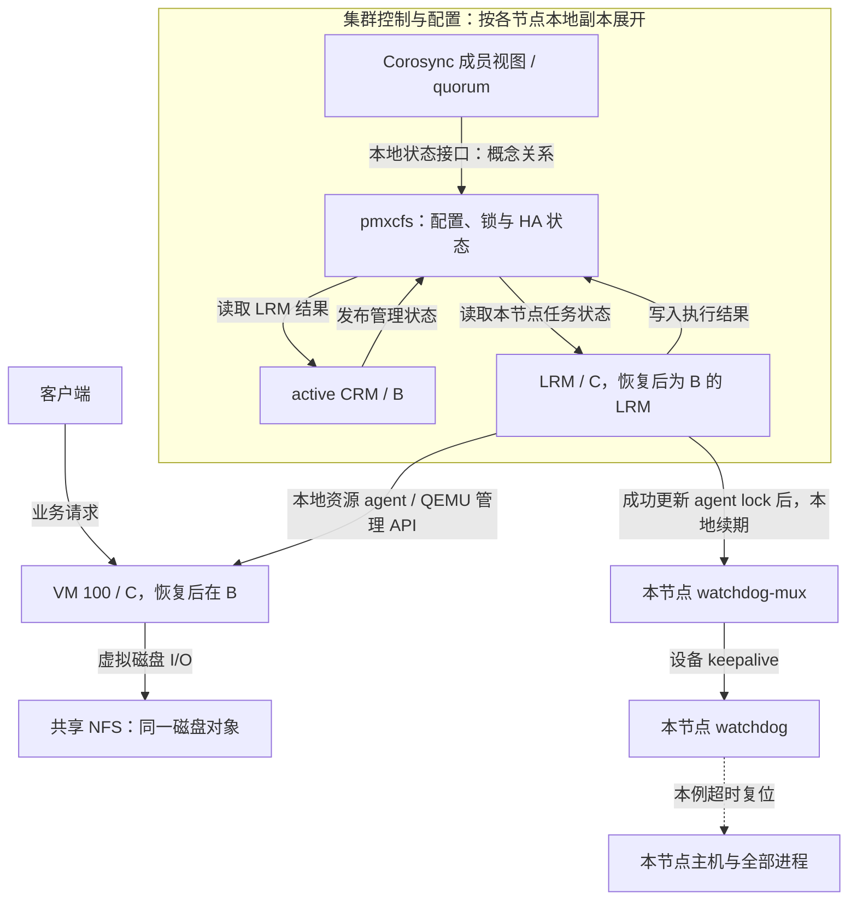

# PVE 01：节点失联但 VM 还在运行，何时才敢接管？

状态：首集完整脚本与分镜，2026-09-13。用户批准继续后，已完成[30 秒机制样片与验证](ha-fencing-30s.md)；本稿的 7 分钟全片尚未制作，也未实施故障实验。关联主题 B4，难度 10 / 学习优先级 10；项目跟踪见 [Issue #1](https://github.com/hobbytp/blender_demos/issues/1)。

## 本集学习目标与场景

观众看完能解释：**多数侧有 quorum 后，为什么还不能立即重启失联节点上的 VM；旧实例如何退出，以及新实例为何可以安全启动。**

- 受众：资深系统架构师。中文旁白、术语保留英文；复用已确认的 ByteByteGo 式内部组件展开和 Remotion 工程。
- 目标：约 7 分钟。下面 420 秒是编辑时间预算，包含动画观察与停顿；不是已测得的配音时长，更不是协议耗时。
- 三个节点 `pve-a / pve-b / pve-c`，每节点一票，expected votes 为 3，quorum 阈值为 2；无 QDevice、无人工调整票数。
- 初始 active CRM 位于 B，VM 100 是 C 上唯一的 HA 资源，期望状态 `started`。A/B 有恢复容量、兼容 CPU、相同业务网络及可用 NFS；本例策略允许最终选择 B，不声称 B 是所有配置下的必选节点。
- NFS 位于独立存储边界，虚拟磁盘可从各节点访问。只切断 C 的全部 Corosync 通信路径，A/B 通信不受影响；C 的业务和存储网络暂时保持可用。故障持续至本例自隔离完成，期间不进行人工强启。
- HA 未处于 maintenance/disarm 等特殊模式，watchdog 已武装、驱动工作正常并能复位主机。C 的 LRM 具有 watchdog 保护；B 的 active CRM 也有保护。没有 HA 工作的空闲 LRM 不画成必然持锁、持续续期。
- 本集以正常路径和一次持续分区作对照；不展开 Ceph、QDevice、CRM 主节点同时失效、watchdog 失效或应用级集群。

## 资料快照与证据边界

| 来源 | 本次核查基准 | 使用范围 |
| --- | --- | --- |
| 本地 pve-ha-manager | `D:\github\pve-related\pve-ha-manager`，master，`c73364c19d5317e6df5bb1c1b727d080a5e897ef`；changelog 标注 5.2.5，工作树干净 | 本稿 HA 调用、状态和 watchdog-mux 代码事实 |
| 本地 pve-docs | `D:\github\pve-related\pve-docs`，master，`1e5d5ec701776acc2d8ab3dca996a27c7a60aee8`；changelog 标注 9.2.9，工作树干净 | 可追溯的手册源码入口 |
| 在线 current 手册 | [HA 章节](https://pve.proxmox.com/pve-docs/chapter-ha-manager.html)，2026-09-13 直接请求读取；文档目录本轮系列核查标注 9.2.10 | 官方角色、锁、fencing 和恢复行为说明 |

PVE 9.x 是已选课程版本系列；以上是资料和源码快照，**尚未验证它们对应同一套已安装稳定软件包组合**。主机完整包清单、watchdog 驱动和实测时间留待实验固定；不将 master 或文档版本直接当作已验收的部署版本。本稿已足以评审因果与分镜；成片中的精确版本标签和任何实测数值应以届时证据为准。

代码图用于发现符号；相关文件 freshness 显示 metadata_changed，Manager.pm 还有局部解析缺口，动态 Perl 调用也有漏边，因此已直接读取本文涉及的源文件段落。本文引用行号以本地上述 commit 为准，不把图中“零调用者”解释为没有调用。没有运行 PVE 测试、HA 模拟器或实机故障测试。

## 事实依据索引

下列 S 编号用于分镜与旁白交叉核查。源码链接固定到 commit；方法名是配套笔记内容，主画面只在有助理解时短暂出现。

| ID | 可以支持的结论 | 依据与准确性边界 |
| --- | --- | --- |
| S1 | CRM 负责集群资源决策；LRM 执行本地动作；manager lock 与 agent lock 分工不同 | [官方 HA 章节](https://pve.proxmox.com/pve-docs/chapter-ha-manager.html)的 How It Works、Locks、LRM、CRM；[CRM.pm:94](https://github.com/proxmox/pve-ha-manager/blob/c73364c19d5317e6df5bb1c1b727d080a5e897ef/src/PVE/HA/CRM.pm#L94)、[PVE2.pm:358](https://github.com/proxmox/pve-ha-manager/blob/c73364c19d5317e6df5bb1c1b727d080a5e897ef/src/PVE/HA/Env/PVE2.pm#L358)。不是 Corosync 为所有操作选出一个通用主节点 |
| S2 | LRM 成功取得/更新 agent lock 后才打开或更新 watchdog；失败转入 lost_agent_lock | [LRM.pm:236](https://github.com/proxmox/pve-ha-manager/blob/c73364c19d5317e6df5bb1c1b727d080a5e897ef/src/PVE/HA/LRM.pm#L236)、同文件 382–408、561–599。恢复锁存在条件分支，本例固定为持续分区 |
| S3 | HA 客户端通过本机 UNIX socket 向 watchdog-mux 续期，mux 再喂 /dev/watchdog | [PVE2.pm:459](https://github.com/proxmox/pve-ha-manager/blob/c73364c19d5317e6df5bb1c1b727d080a5e897ef/src/PVE/HA/Env/PVE2.pm#L459)、[watchdog-mux.c:293](https://github.com/proxmox/pve-ha-manager/blob/c73364c19d5317e6df5bb1c1b727d080a5e897ef/src/watchdog-mux.c#L293)。超期客户端使 mux 停止设备续期；主机复位还依赖正确工作的 watchdog，不是 LRM 直接执行关机命令 |
| S4 | 多数侧先将失联节点视为 unknown；满足离线延迟条件后，运行中服务转入 fence | [NodeStatus.pm:8](https://github.com/proxmox/pve-ha-manager/blob/c73364c19d5317e6df5bb1c1b727d080a5e897ef/src/PVE/HA/NodeStatus.pm#L8)、50–68、134–198；[Manager.pm:1404](https://github.com/proxmox/pve-ha-manager/blob/c73364c19d5317e6df5bb1c1b727d080a5e897ef/src/PVE/HA/Manager.pm#L1404)。unknown 明确容许节点仍在运行；不能直接标成断电 |
| S5 | 默认这条 fencing 路径通过取得旧节点 agent lock 确认可恢复；没有从旧节点发来的“已关机 ACK” | [NodeStatus.pm:254](https://github.com/proxmox/pve-ha-manager/blob/c73364c19d5317e6df5bb1c1b727d080a5e897ef/src/PVE/HA/NodeStatus.pm#L254)、[PVE2.pm:297](https://github.com/proxmox/pve-ha-manager/blob/c73364c19d5317e6df5bb1c1b727d080a5e897ef/src/PVE/HA/Env/PVE2.pm#L297)、375–381；结合官方 Locks/Fencing 说明。安全性依赖锁和 watchdog 的配套约束，不能宣称普通文件锁本身能让主机关机 |
| S6 | fencing 成功后服务进入 recovery，再选择目标、转移配置归属和更新期望状态 | [Manager.pm:1188](https://github.com/proxmox/pve-ha-manager/blob/c73364c19d5317e6df5bb1c1b727d080a5e897ef/src/PVE/HA/Manager.pm#L1188)、1638–1692；[PVE2.pm:208](https://github.com/proxmox/pve-ha-manager/blob/c73364c19d5317e6df5bb1c1b727d080a5e897ef/src/PVE/HA/Env/PVE2.pm#L208)。没有可用目标会继续等待；配置归属移动不等于复制磁盘 |
| S7 | CRM/LRM 的协作包含共享管理状态与本地执行结果，不应画成直接网络 RPC | [Config.pm:16](https://github.com/proxmox/pve-ha-manager/blob/c73364c19d5317e6df5bb1c1b727d080a5e897ef/src/PVE/HA/Config.pm#L16)、62–89、290–300；[PVE2.pm:88](https://github.com/proxmox/pve-ha-manager/blob/c73364c19d5317e6df5bb1c1b727d080a5e897ef/src/PVE/HA/Env/PVE2.pm#L88)；[LRM.pm:720](https://github.com/proxmox/pve-ha-manager/blob/c73364c19d5317e6df5bb1c1b727d080a5e897ef/src/PVE/HA/LRM.pm#L720)。关键对象为 ha/manager_status 与 nodes/<node>/lrm_status；网络复制由集群配置层承担 |
| S8 | 本地资源 agent 执行启动，再检查 VM 运行状态；VM 正在运行不证明应用已就绪 | [LRM.pm:974](https://github.com/proxmox/pve-ha-manager/blob/c73364c19d5317e6df5bb1c1b727d080a5e897ef/src/PVE/HA/LRM.pm#L974)、[PVEVM.pm:72](https://github.com/proxmox/pve-ha-manager/blob/c73364c19d5317e6df5bb1c1b727d080a5e897ef/src/PVE/HA/Resources/PVEVM.pm#L72)。调用 QEMU 管理 API 并等待任务；应用健康需另外观察 |
| S9 | 失去 quorum 时 pmxcfs 只读；这不等于立即停止既有 VM，也不负责复制 VM 磁盘 | [官方 pmxcfs 章节](https://pve.proxmox.com/pve-docs/chapter-pmxcfs.html)、[已固定手册源码](https://github.com/proxmox/pve-docs/blob/1e5d5ec701776acc2d8ab3dca996a27c7a60aee8/pmxcfs.adoc)；本例结合 S2–S5 说明后续 HA 行为 |
| S10 | 不能把“失联后恰好 60 秒接管”作为普遍结论 | 此源码 NodeStatus 的 fence_delay 为 60，watchdog-mux 的客户端超时为 60、设备请求超时初值为 10，PVE2.pm 锁逻辑引用 pmxcfs 的 120 秒生命周期限制。它们起点、语义和执行循环不同；不机械相加，也不把任何一个数当成端到端恢复时间 |

## 画面架构与数据路径

保持 A、B、C 的位置固定；上方是客户端，下方是共享 NFS。每次最多展开一个重点节点，另一个相关节点保留缩略剖面，全局拓扑始终留在角落。B 上只突出 active CRM，C 上突出 LRM 与 VM；其他 CRM 标为待命。

上图的 CFS 是逻辑层，不是第四台中央服务器；动画在各节点画本地 pmxcfs，跨节点状态传播画在 A/B/C 的控制网络上。LRM→MUX 是 UNIX socket；MUX→watchdog 是本地设备操作。B 的 active CRM 也有本地 watchdog 连接，在相关镜头中作次要参照。

四类动画标识：业务/磁盘 I/O 用带内容的圆点；集群状态传播用小矩形消息；本地调用与续期用短脉冲和文字标签；未知状态用虚线边框和问号。颜色辅助识别，不承担唯一语义。fencing 判定成功后，不改变 NFS 的位置，也不画磁盘飞到 B。

## 分镜与时间预算

所有时间均为视频播放时间。04–08 镜是同一次故障中两侧并行发生的过程；镜头切换用于解释，不表示先讲完 C 才轮到 B 开始检测。用双轨事件条保持两侧进度；不设置“精确 60 秒接管”倒计时。

| 镜号 / 时间 | 旁白段 | 触发与路径 | 焦点组件及观众看到的变化 | 期末状态 / 依据 |
| --- | --- | --- | --- | --- |
| 01 / 00:00–00:30 | N01 | 客户端请求经过 C 的 VM；切断控制链路 | 业务圆点仍通，C 上 VM 小进度条继续动；B 上出现“启动副本？”的概念按钮但未执行 | 建立“失联不等于停止”的问题；S4/S9 |
| 02 / 00:30–01:05 | N02 | 从全局原位展开 B 的 CRM、C 的 LRM、各自 pmxcfs | manager lock、C 的 agent lock 分别贴在实际持有者旁；NFS 独立于控制层 | 角色与锁类型可区分；S1/S7 |
| 03 / 01:05–01:40 | N03 | 正常状态循环：C 续锁→本地续期；结果→pmxcfs→B | 每次成功续锁才产生到 mux 的脉冲；B 的管理状态与 C 的执行状态分栏 | 正常预设场景的稳定终点；S2/S3/S7 |
| 04 / 01:40–02:15 | N04 | 持续分区→成员重组→quorum 改变 | C 的所有 Corosync 路径断开；AB 显示 2/3、C 显示 1/3。C 的 NFS/业务箭头保留 | AB 有 quorum、C 无 quorum；票数为本例固定配置 |
| 05 / 02:15–02:50 | N05 | C：pmxcfs 写入/续锁失败→LRM 状态变化 | `active → lost_agent_lock`，续期路径停止；VM 仍可运行。左下提示“多数侧并行等待” | 不把失锁画成 VM 已停；S2/S9 |
| 06 / 02:50–03:30 | N06 | C：客户端超期→mux 停喂→watchdog 超时 | 分开画“HA 客户端续期”和“设备喂狗”两层；复位时 C 上全部进程熄灭、业务中断 | 导演剖面展示主机复位；不是 B 收到的遥测或 ACK；S3/S10 |
| 07 / 03:30–04:10 | N07 | 回看同一时段 B：失联→unknown→延迟判断→fence | 双轨定位回到 B；旧节点锁获取尝试未成功时，启动路径保持封闭 | VM 管理状态等待 fence；计时与锁条件不能略过；S4/S5 |
| 08 / 04:10–04:45 | N08 | B：获取 C 的 agent lock 成功→fencing 判定成立 | 返回脉冲从 B 本地 pmxcfs 到 CRM，标签“旧节点 agent lock 获取成功”；service `fence → recovery` | 绝不画 C→B 的“我已关机”消息；S5/S6 |
| 09 / 04:45–05:30 | N09 | CRM 选 B→移动配置归属→发布状态→B 的 LRM→资源 agent→启动 | 配置标签由 C 归属区移到 B；磁盘留在 NFS。B 的 LRM 获得自身锁并建立保护，启动 VM 后回写结果 | 区分“期望 started”“QEMU 已运行”“应用待就绪”；S6/S7/S8 |
| 10 / 05:30–06:05 | N10 | 启动后的 VM 发起磁盘读取；应用独立恢复 | 旧 RAM 状态淡出，新系统启动条出现；NFS 数据仍在原处。独立业务探测示意后才亮应用就绪 | 这是故障后重启，不是热迁移；数据一致性与应用就绪另有条件；S8 |
| 11 / 06:05–06:35 | N11 | 在启动门前暂停回顾：quorum、fencing、目标条件 | 先隐藏答案留 5 秒思考，再依次高亮缺一不可的条件。显示对照：有 quorum / 尚未 fencing → 继续等待 | 检验是否能区分管理许可、旧实例隔离与可启动条件；S1/S5/S6 |
| 12 / 06:35–07:00 | N12 | 整体回放因果箭头 | 分区→失去续锁能力→watchdog 自隔离；多数侧获得锁→恢复配置归属→本地启动。底部接下一集热迁移 | 保留完整拓扑、身份与数据边界；不引入新机制 |

## 逐段旁白稿

### N01

三台 PVE 节点组成一个集群，虚拟机一百正在 C 上提供服务。现在，C 和另外两台之间的集群通信中断了。但是看这两条线：客户端仍能访问它，它也还能读写共享存储。A 和 B 已经联系不上 C，却不能据此知道那台虚拟机是否停止。如果此时在 B 上再启动一个副本，两份实例就可能同时操作同一份磁盘。PVE 要解决的核心问题就在这里：什么时候，才有足够的依据开始接管？

### N02

先把服务器外壳打开。每台节点上都有 CRM 和 LRM，但本例只有 B 的 CRM 持有集群管理锁，负责做资源决策。C 的 LRM 负责执行本机的虚拟机动作，并持有属于 C 的 agent lock。两种锁承担不同的职责。旁边的 pmxcfs 保存集群配置、锁和 HA 状态；下方的 NFS 则保存虚拟磁盘。配置协作与磁盘访问走的是不同路径。接下来，我们沿着这些内部连接看故障如何传播。

### N03

正常运行时，C 的 LRM 持续更新自己的 agent lock。更新成功后，它会给本机 watchdog-mux 发送一次续期。mux 再负责给主机的 watchdog 喂狗。这里的续期发生在本机，不是发给其他节点的网络心跳。另一条路径负责 HA 协作：管理状态通过 pmxcfs 提供给 LRM，LRM 把执行结果写回，CRM 再读取这些结果。动画里的短脉冲与跨节点消息，代表的是两种不同的通信。

### N04

现在让故障持续发生。断开的是 C 的全部 Corosync 通信路径，而不是整台主机的所有网络。成员关系重新形成后，A 和 B 这一侧有两票，满足本例三票集群的 quorum 条件；C 只有一票，不满足条件。多数侧可以继续进行受 quorum 约束的集群管理操作。但请留意，业务流和存储流仍在运动。票数说明了哪一侧能继续参与集群管理，还没有直接回答旧虚拟机是否已经退出。

### N05

放大 C 的内部。失去 quorum 后，本机的 pmxcfs 进入只读约束，LRM 无法继续成功更新自己的 agent lock。它从 active 转为 lost agent lock，原来通向 watchdog-mux 的正常续期不再继续。可是，这并不是向 QEMU 发出一条立即停止命令。虚拟机仍可能运行，甚至仍能服务客户端。这个阶段最容易被误解：集群管理能力已经丢失，业务执行却还没有必然停止。系统需要另一个机制结束这种危险的不确定状态。

### N06

这个机制就是 watchdog 保护。看清这里的两层计时：LRM 是 mux 的客户端，mux 是 watchdog 设备的使用者。当客户端持续没有有效续期，mux 检测到超期，停止继续给设备喂狗；在本例工作正常的 watchdog 下，设备超时使主机复位。于是，C 上的旧虚拟机和其他进程一起停止。我们正在用剖面看到 C 内部发生的事情，这并不表示多数侧收到了一条关机回执。动画也只展示因果顺序，不把播放秒数当成真实故障耗时。

### N07

与此同时，B 的 CRM 也在处理同一场故障。它将不在可用集群成员中的 C 视为 unknown。这个名字很准确：未知，意味着不能排除它仍在运行。经过相应的离线延迟判断，虚拟机的管理状态进入 fence，等待隔离条件成立。CRM 会尝试取得 C 原先持有的 agent lock。只要这个条件还没有满足，恢复流程就不能越过这道门。多数侧的等待，与少数侧的 watchdog 过程，是配套工作的两条路径。

### N08

现在，B 终于成功取得了旧节点的 agent lock。源码中的 fencing 判定就在这里确认成功，然后把服务从 fence 转入 recovery。请注意，成功结果来自集群锁操作，不是 C 发来一句“我已经关机”。这也不是说一个普通文件锁就能关闭远程主机。PVE 把锁的有效性约束与旧节点上的 watchdog 保护配合起来，建立安全恢复的条件。忽略其中任何一部分，都无法解释为什么这个时刻可以放行。

### N09

进入 recovery 后，CRM 根据可用节点和放置规则选择恢复位置。我们这个例子选择 B。接着，虚拟机配置的节点归属发生变化，管理状态告诉 B 的 LRM：这份资源现在应当在本机运行。B 的 LRM 建立自己的锁和 watchdog 保护，再通过本地资源 agent 调用 QEMU 管理接口启动虚拟机，并记录执行结果。看下方：NFS 中的磁盘对象没有搬家。发生变化的是配置归属与运行位置，而不是把整块磁盘从 C 复制到了 B。

### N10

到这里，虚拟机在 B 上重新启动。它读取共享磁盘，启动操作系统，再由应用完成自身恢复。C 的运行内存并没有在这次故障中被传送过来，所以这与热迁移有根本不同。还要区分三个时刻：HA 期望它运行，QEMU 确实运行，以及用户业务真正可用。前两个状态不能替代第三个。共享存储让目标节点能访问磁盘，却不自动保证所有缓存数据都已持久化，也不替应用完成一致性恢复。

### N11

回到刚才的启动门前，做一个判断：如果 A 和 B 已经有 quorum，但还没有取得旧节点的 agent lock，能否启动恢复实例？暂停想一想。答案是继续等待。quorum 允许多数侧继续集群管理，fencing 条件约束旧实例的干扰，而恢复节点还必须具备可用存储、网络和资源条件。这几件事共同组成接管的前提。我们不能只看票数，也不能把“看不到旧节点”当成“旧节点已经安全退出”。

### N12

把整条链再连起来：分区让 C 失去续锁能力，watchdog 保护使旧实例退出；多数侧满足安全锁条件后，才恢复配置归属并在目标节点启动资源。这就是本集要掌握的 HA 接管逻辑。下一集，我们保留这张拓扑，改看两边仍能协作时，运行中的虚拟机如何完成热迁移。

## 约 30 秒机制样片的取段建议

全片分镜通过后，取 05–08 镜的双轨因果片段，不从头重新设计风格。建议四拍：0–7 秒 C 续锁失败但 VM 仍运行；7–15 秒 LRM→mux 续期中止，watchdog 复位主机；15–24 秒多数侧的旧节点锁获取由失败变为成功；24–30 秒服务进入 recovery，启动门放行。旁白需另做短版，不能把完整四段配音强行加速。

短片始终标注“教学时间轴”；镜头可展示导演视角下 C 已复位，同时 B 仍显示“状态未知 / 等待锁”，让观众分清客观状态与节点所知。正常和故障预设使用同一初始拓扑，每次切换重置事件进度；不增加可调协议参数或仿真引擎。

## 评审与后续验证

本轮按以下专业视角自审，不代表外部专家或实机验收。已核实的问题直接改入上述脚本和分镜；待验证的意见留到样片中检验。

| 审查视角 | 问题及影响 | 本稿处理 / 状态 |
| --- | --- | --- |
| 分布式协议 | 导演知道 C 已复位，不等于 B 收到确切停机通知；混淆会破坏 fencing 的解释 | C 的客观状态与 B 的已知状态分开；成功脉冲来自锁操作，删除远程 reset ACK 的可能画法。已落实，S4/S5 |
| 操作系统与 HA 实现 | LRM 续期与设备喂狗被画成同一个动作，会隐藏 watchdog-mux 的作用 | 拆成 UNIX socket 客户端续期与设备 keepalive 两段；只将工作正常的 watchdog 作为本例前提。已落实，S2/S3 |
| 存储与虚拟化 | 配置移动很容易被误看成磁盘复制或运行状态迁移 | NFS 和磁盘对象固定；配置归属标签移动，目标 VM 展示重新启动与新内存。已落实，S6/S8/S9 |
| 教学设计 | 按镜头顺序讲完 C 再讲 B，容易被理解为两侧串行处理 | 04–08 镜保留双轨事件条；将前置知识收敛到角色、两类锁和存储边界。已落实；首次观看是否能跟上仍待样片验证 |
| 动效与声音 | 一屏同时播放所有箭头会争夺注意；长时间代码截图会中断空间参照 | 每拍只突出一条因果路径，其他路径弱化但保留；源码函数只在关键判定短暂出现。已写入约束，实际字幕密度、节奏和配音停顿待 TTS/样片验证 |
| SRE 与可观测性 | 管理状态 started、QEMU 活着和业务恢复被合成一个绿灯，会夸大恢复能力 | 分三栏呈现；业务探测是独立观察，不画成 HA 内置应用探活。所有运行时长和恢复顺序标为未实测。已落实，S8/S10 |

- 因果审查：旧 VM 可能仍活着时不启动新实例；拿到 quorum 不跳过 fencing；未取得旧节点 agent lock 不进入 recovery；图中的共享磁盘不随配置移动。
- 状态审查：将 CRM 节点状态、服务管理状态、LRM 状态、QEMU 实际状态和应用健康分栏；`started` 管理状态不直接点亮“业务已恢复”。
- 视觉审查：动作端点落到具体组件；本地续期、跨节点传播、磁盘 I/O 可区分；不画远程 reset ACK 或 NFS 主动切断 C。片内保留正常工作的 watchdog 这一前提。
- 下一步制作验证：用真实 TTS 校准时间槽，优先保留机制观察时间；超过 8 分钟则精简旁白或拆分，不整体快放消息。先完成选定机制样片，再扩展全片；已有视觉批准继续有效。
- 选做实机证据：在单独授权的可恢复实验环境核对 `pveversion -v`、Corosync 配置、HA 资源和 watchdog 驱动；采集两侧 HA 日志、节点启动记录、QEMU 状态及独立业务探测，比较故障、fencing 判定和业务恢复的实际顺序。本稿没有执行网络隔离、重启或存储写入。
- 本次文档交付检查：源文件关键分支已直接核对；分镜预算连续覆盖 0–420 秒，每镜都有对应旁白和依据。教学理解度、实际 TTS 节奏与硬件时序仍待样片/实验验证。
